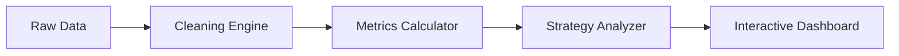

# 📊 Project Report: Binance Trade Analytics & Risk Intelligence

## 1. Objective
The primary objective of this project is to provide traders and analysts with a professional-grade tool to evaluate trading performance. It transforms raw, complex Binance trade data into clear, actionable insights, helping users understand their risk, profitability, and strategy consistency.

---

## 2. Project Overview
This system is an automated analytics engine. It takes a "messy" file of trade history (what you get from Binance) and cleans it up. It then performs complex financial calculations to show you exactly how much money was made, where the risks were, and how well the chosen strategy followed market trends.

---

## 3. Target Users
- **Novice Traders:** Who want to understand their performance without manually calculating math.
- **Portfolio Managers:** Who need to track multiple accounts (Portfolios) in one place.
- **Data Analysts:** Who want to find patterns or anomalies in trading behavior.

---

## 4. Introduction to Trading (Binance)
Binance is one of the world's largest cryptocurrency exchanges. "Trading" involves buying and selling digital assets (like Bitcoin or Solana) to make a profit. 
- **Spot Trading:** Buying the actual coin.
- **Futures Trading:** Trading contracts based on the price of the coin (often using leverage).
This dashboard focuses on **Realized PnL**—the actual profit or loss you made once a trade was closed.

---

## 5. Data Description
The system analyzes standard Binance trade history files (CSV format). Key data points include:
- **Time:** When the trade happened.
- **Symbol:** Which asset was traded (e.g., BTCUSDT).
- **Side:** Whether it was a BUY or a SELL.
- **Price:** The execution price.
- **Quantity:** How much was traded.
- **Realized Profit:** The net result of the trade.
- **Fee:** The commission paid to the exchange.

---

## 6. How the Project Works (The Pipeline)
1. **Data Ingestion:** The dashboard loads the CSV file.
2. **Cleaning & Normalization:** It extracts "hidden" details from nested data and fixes missing values.
3. **Metric Engine:** The system calculates ROI, Win Rate, and Drawdown for every portfolio and symbol.
4. **Strategy Simulation:** It applies technical indicators (EMA/RSI) to the historical data to see "what would have happened."
5. **Visualization:** Interactive charts are generated so you can "see" the growth of your money.

### 🔄 Data Flow

---

## 7. Strategy Explanation
We use a **Trend-Following Strategy** combining two powerful tools:
- **EMA (Exponential Moving Average):** Think of this as a "smoothed" price line. When the short-term line (12-period) crosses above the long-term line (26-period), it signals an upward trend (Buy).
- **RSI (Relative Strength Index):** This measures how "fast" prices are moving. If RSI is above 70, the market might be "overheated" (Overbought). If below 30, it might be "oversold."
**The Rule:** We only suggest a Buy if the trend is up AND the market isn't already overheated.

---

## 8. Metrics Explanation
- **PnL (Profit and Loss):** Your total earnings minus your total losses.
- **ROI (Return on Investment):** The percentage of profit relative to your starting capital. (If you start with $100 and have $110, your ROI is 10%).
- **Win Rate:** The percentage of your trades that were profitable.
- **Drawdown:** The "deepest dip" your account took from its highest point. It measures the pain you had to endure to get your profit.

---

## 9. Key Insights from Data
- **Asset Concentration:** Usually, 2-3 symbols (like BTC or SOL) contribute to 80% of total profits.
- **Timing:** Data often reveals that certain hours of the day are significantly more profitable than others.
- **Anomaly Detection:** The system flags trades with unusually high fees or extreme results that might need a manual "double-check."

---

## 10. Risks and Limitations
- **Data Dependency:** The analysis is only as good as the file provided.
- **Market Dynamics:** Crypto markets can change instantly; a strategy that worked yesterday might not work tomorrow.
- **Execution Gap:** Real-world trading involves "slippage" (getting a slightly different price), which backtests cannot perfectly predict.

---

## 11. Validation Note
All results shown in this dashboard are based on **historical (past) data**. While they provide a clear map of what happened, they do not guarantee future success.

---

## 12. How to Use the Dashboard
1. **Configure Capital:** Set your initial starting balance in the sidebar.
2. **Filter your View:** Use the sidebar to pick a specific Portfolio or Symbol you want to analyze.
3. **Change Timeframe:** Switch between '5m', '1h', or '1d' to see how the strategy performs on different scales.
4. **Review Visuals:** Scroll down to see the Equity Curve (how your money grew) and the Anomaly list (for risk checks).

---

## 13. Future Improvements
- **AI-Powered Forecasting:** Using Machine Learning to predict future trends.
- **Live Connection:** Connecting directly to Binance via API for real-time updates.
- **Multi-Asset Support:** Including Stock or Forex data analysis.

---

## 14. Disclaimer
**NOT FINANCIAL ADVICE.** This project is for educational and analytical purposes only. Trading cryptocurrencies carries a high level of risk. Never invest money you cannot afford to lose.
