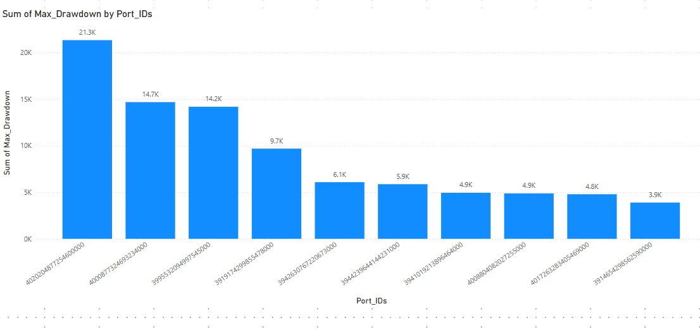
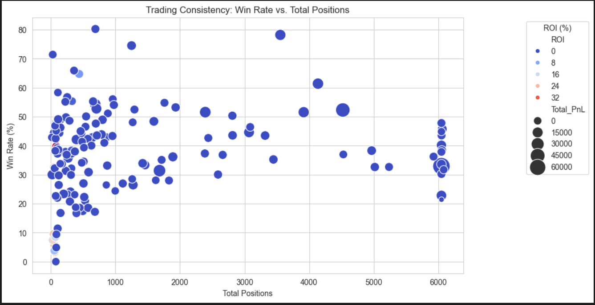

# binance-trade-analysis

📊 Trading Performance Analysis Report

# Business Understanding

## Objective
The goal of this analysis is to evaluate historical trading performance across various Binance accounts over 90 days. We calculate financial metrics for each account, rank them based on key performance indicators, and identify the Top 20 best-performing accounts.

# Data Understanding
Dataset Overview
•	Port_IDs: Unique identifiers for trading accounts.
•	Trade_History: List of executed trades, including timestamps, symbols, prices, and quantities.
                        - time: Trade timestamp (convert to datetime).
                        - symbol: Traded asset (e.g., BTCUSDT).
                        - side: BUY/SELL action.
                        - price: Execution price.
                        - quantity: Money involved in the trade.
                        - realizedProfit: Profit/loss from the trade.
•	Metrics Calculated: ROI, PnL, Sharpe Ratio, Win Rate, Max Drawdown, etc.
                        ROI                         =               Final Value - Initial Value 
                                                                    ---------------------------
                                                                          Initial Value

                        PnL                         =     df.groupby("Port_IDs")["realizedProfit"].sum()

                        Win Rate                    =                    Win Positions 
                                                                        --------------
                                                                        Total Position         
                                                          ## Count realizedProfit > 0 using sum().

                        Sharpe Ratio                =            Mean Daily Returns - Risk-Free Rate 
                                                                --------------------------------------
                                                                         Std Dev of Returns                 
                                                           ## Use returns.mean() / returns.std().

                        MDD (Maximum Drawdown)      =     Compute peak-to-trough drop using cummax() and min().

                        Total Positions             :       Count total trades.
                        Win Positions               :       Count trades with realizedProfit > 0.
                        Win Rate                    :       Win Positions / Total Positions.
                        PnL (Profit & Loss)         :       Sum of realizedProfit.
                        MDD (Maximum Drawdown)      :       Largest peak-to-trough loss in the trade sequence.

Data Understanding & Preprocessing
Initial Data Structure
•	Total Records: 150 accounts.
•	Trade History Format: JSON-like objects.
•	Missing Values: Found in the Trade_History column (1 record missing).

| Metric                        | Definition                                     |                     Formula                                |
|-------------------------------|------------------------------------------------|------------------------------------------------------------|
| ROI (Return on Investment)    | Measures return relative to initial investment | (Final Value - Initial Value) / Initial Value              |
| PnL (Profit and Loss)         | Total profit/loss over 90 days                 | ∑ realizedProfit                                           |
| Sharpe Ratio                  | Risk-adjusted return                           | (Mean Daily Returns - Risk-Free Rate) / Std Dev of Returns |
| MDD (Maximum Drawdown)        | Max loss from peak                             | (Peak Value - Trough Value) / Peak Value                   |
| Win Rate                      | Percentage of profitable trades                | Win Positions / Total Positions                            |
| Win Positions                 | Number of trades with positive profit          | Count of realizedProfit > 0                                |
| Total Positions               | Total number of trades                         | Count of all trades                                        |

metric impact on score :  

| Metric                     | Description                          | Impact on Score      |
|----------------------------|--------------------------------------|----------------------|
| ROI (Return on Investment) | Profitability of the account (%)     | Higher is better (+) |
| PnL (Profit & Loss)        | Total profit or loss ($)             | Higher is better (+) |
| Sharpe Ratio               | Risk-adjusted return                 | Higher is better (+) |
| MDD (Maximum Drawdown)     | Max loss from peak value             | Lower is better  (-) |
| Win Rate                   | Percentage of profitable trades (%)  | Higher is better (+) |
| Win Positions              | Number of profitable trades          | Higher is better (+) |
| Total Positions            | Total number of trades               | More positions help but should be weighted properly (+) |

# Data Preparation 
A weighted scoring system was implemented to rank accounts based on their performance:

ROI (30%)

PnL (20%)

Sharpe Ratio (20%)

Win Rate (20%)

MDD (-10%) (Lower is better)

Each metric was normalized, and the final ranking score was computed based on the weighted sum of these metrics.

# note :  We can modify the weighted scoring system based on your specific priorities

Risk-Adjusted Performance Focus (More emphasis on risk-adjusted returns)
                    ex:
                        -Sharpe Ratio → 25% (↑ Emphasizing risk-adjusted returns)
                        -Max Drawdown (MDD) → -20% (↓ Stronger penalty for high drawdowns)
Profitability-Oriented Approach (More focus on absolute profit)
                    ex:
                        -PnL → 30% (↑ Higher emphasis on absolute profit)

🔍 Key Metrics and Insights:
✅ Total Profit and Loss (PnL): 691.05K – A significant indicator of overall portfolio performance.
✅ Return on Investment (ROI): 182.85 – Measuring portfolio efficiency in generating returns.
✅ Win Rate: 5.56K – The number of successful trades contributing to profitability.
✅ Sharpe Ratio: 27.68 – A measure of risk-adjusted returns, higher values indicate better reward-to-risk performance.
✅ Max Drawdown: 21.34K – Represents the worst portfolio decline, crucial for risk management.

✔️ Optimize risk management strategies ⚠️
✔️ Improve portfolio performance 📈
✔️ Maximize returns while minimizing drawdowns 💰

🔹 140 accounts have an ROI close to zero, indicating a large portion of portfolios with minimal gains or break-even performance.
🔹 A few accounts stand out with higher ROI, showing exceptional returns and strategic success.
🔹 Understanding this distribution helps us refine our investment strategies and manage risk effectively.

🔹 Identifying top-performing portfolios helps optimize investments.
🔹 Recognizing low ROI portfolios allows for better risk management and strategy adjustments.--3788465932399412000
🔹 Data-driven decisions can enhance profitability and minimize losses.

🔹 Top performer: Account 4020348172640000 leading with a massive 72K in profits!
🔹 Second place: Account 3992498732332000 follows with 43K in profits.
🔹 Other high achievers range between 14K – 26K, showing strong performance across multiple accounts.

💡 This data-driven approach helps us identify high-yield portfolios, optimize strategies, and enhance decision-making for future investments.

🔻 Highest Drawdown: 21.3K – The most vulnerable portfolio, facing the largest peak-to-trough decline.
    ( indicate increased risk exposure and potential capital loss.)
🔻 Multiple Portfolios in High Risk Zone – Several portfolios have drawdowns exceeding 10K, indicating significant capital erosion.
    ( )
🔻 Better Risk-Managed Portfolios – Some portfolios maintain drawdowns below 5K, showing improved stability.

The Sharpe Ratio is a key metric for evaluating risk-adjusted returns. This visualization showcases the performance of various portfolios:

🔹 Some portfolios exhibit high Sharpe Ratios, indicating strong risk-adjusted returns.
🔹 Others fall lower, suggesting potential inefficiencies or higher risk exposure.
🔹 Identifying and optimizing these variations is crucial for strategic portfolio management.

📉 Higher win rates don't always mean higher ROI! Some portfolios with lower win rates have significantly higher returns.
💰 Clusters around low ROI: Many portfolios maintain win rates between 20% - 60%, but their ROI remains close to zero.
📈 Outliers with high ROI: A few portfolios exhibit exceptionally high ROI, even with moderate win rates

🔹 Trade Results Breakdown: 60.3% of trades are losses, while 39.7% result in winning – highlighting the importance of risk management.
🔹 Sharpe Ratio Distribution: Most portfolios fall in the 0.09–0.23 range, indicating moderate risk-adjusted returns.
🔹 Realized Profit Over Time: Profitability spiked significantly in recent months, signaling a shift in market conditions or strategy performance.

📢 Data-driven decisions are key to maximizing returns & minimizing risk! How do you incorporate performance analytics into your strategy? Share your thoughts! ⬇️

This chart represents the Top 10 Most Profitable Accounts, using:
📊 Blue Bars → Total PnL ($)
📈 Red Line → ROI (%)

Key Observations:
Some accounts have high PnL but low ROI, meaning they generate large profits but might have large capital investments.
Some accounts have low PnL but high ROI, suggesting they achieve strong percentage returns on smaller capital bases.
The spikes in ROI indicate outlier accounts with exceptionally high returns despite lower total profits.
The two highest PnL accounts (leftmost blue bars) dominate the rankings, but their ROI varies significantly.
Possible Insights/Improvements:
If we prioritize ROI over PnL, rankings might change significantly.
If risk-adjusted metrics (Sharpe, MDD) are added, accounts with high but volatile profits may rank lower.
A log scale for ROI might improve readability, especially if some accounts have extreme ROI values.

Key Observations:
📌 Strong Positive Correlations:

Win Positions & Total Positions (0.95): This makes sense since more total trades generally mean more winning trades.
Score & Win Positions (0.74): More winning trades contribute significantly to the final ranking score.
Score & Total PnL (0.45): Profitability plays an important role in ranking accounts.
📌 Negative Correlations:

ROI & Win Rate (-0.3): Higher ROI does not necessarily mean a higher win rate—suggesting high-ROI accounts may take riskier trades.
Max Drawdown & Sharpe Ratio (-0.4): Accounts with better risk-adjusted returns (higher Sharpe) tend to have lower drawdowns.
📌 Weak or No Correlation:

Total PnL & ROI (-0.074): Indicates that high-profit accounts may not always have high percentage returns, likely due to large capital investment.
Sharpe Ratio & Score (0.25): The Sharpe Ratio plays a minor role in the current scoring system.
Potential Adjustments to the Scoring Model:
If Sharpe Ratio is increased in weight, accounts with lower risk-adjusted returns will rank lower.
If Max Drawdown is penalized more, accounts with high volatility will be ranked lower.
If PnL weight is reduced, smaller but high-ROI accounts could move up in rankings.

o	High ROI & High PnL: Best traders
o	High ROI & Low PnL: Good risk management
o	Low ROI & High PnL: Large volume traders with less efficiency
o	Low ROI & Low PnL: Poor performers

Most traders have weak risk-adjusted performance (Sharpe Ratio between 0.0 and 0.2).
Only a few traders achieve a strong Sharpe Ratio (>0.4), showing high efficiency.
Some traders have negative Sharpe Ratios, meaning their strategies are not working well.
The presence of a long tail suggests that a small number of traders are highly successful in managing risk vs. reward.

Stable Performance: These top 10 accounts have minimal peak-to-trough declines, indicating strong risk management.
Drawdown Variation: Some accounts have near-zero drawdowns, while a few exceed 10–20 USD, showing higher volatility.
Notable Outliers: Two accounts have the highest drawdowns (~20 USD, ~18 USD), implying greater temporary losses.
Conclusion: Lower drawdowns suggest better capital preservation, but comparing PnL and Sharpe Ratios would provide deeper insights into overall performance. 🚀

Diverse Win Rates: Traders with a high number of positions exhibit varying win rates, with most clustering around 30–50%.
High-Volume Traders: A group of traders with 6000+ positions shows mixed win rates, with some having low success rates.
ROI Impact: The color intensity represents ROI (%), with lighter shades (higher ROI) scattered among lower-volume traders.
Profitability: Larger bubbles indicate higher PnL, suggesting that higher total trades do not always guarantee higher profits.
Key Takeaway: While some traders maintain high win rates, profitability depends on both ROI and the number of trades executed efficiently. 🚀

>>> The most profitable account based on Total PnL is Port_ID  with  2427.292831 . The account with the highest ROI is Port_ID 3977234346014419201 with  36.530497.

>>> The best risk-adjusted trader is Port_ID  3826087012661391104 with a Sharpe Ratio of 0.675101 . These traders have the highest returns per unit of risk taken.

>>> The safest traders, based on lowest drawdown, are led by Port_ID   3977234346014419201 , which only had a max loss of   0.0 .

>>> The most consistent traders have a Win Rate > 56.054280. Port_ID 3733192481840423936 has the highest Win Rate 80.261248  with a high number of trades, showing strong consistency.

>>> the best-performing account that satisfies all key performance metrics:Account ID-3977234346014419201,Total PnL-0.17516 (Profitable)ROI-1.000 (Highest), Win Rate -49.5% (Consistent ), Win Positions-33,Total Positions  83,Sharpe Ratio-0.508 (Good Risk-Adjusted Return), Max Drawdown-1.0 (Lowest ), Overall Score-0.6357 (Best in dataset )

# Conclusion

This analysis provides an objective ranking of accounts based on financial performance using key metrics. The methodology ensures that both profitability and risk-adjusted returns are considered, making the rankings reliable for decision-making.

# note:
Regression and classification are not needed because you are not predicting future values or categorizing traders. Instead, you are:

✅ Calculating financial metrics (ROI, PnL, Sharpe Ratio, etc.).
✅ Ranking accounts based on these metrics.
✅ Summarizing insights in a report.

🎯 Final Business Insights
>>Profitability ≠ Best Performance  : Some traders generate the most profit but take excessive risks.
>>Best traders balance profit & risk: High Sharpe Ratio traders have optimized returns per risk taken.
>>Consistent winners > Lucky winners: A high Win Rate with controlled risk is key to sustainable success.

# Attachments

email --> ramyasreekodati@gmail.com

git repositor -- > https://github.com/Ramyasreekodati/binance-trade-analysis.git

linkedin --> www.linkedin.com/in/ramyask2025

resume --> https://drive.google.com/file/d/1qO1XDu52_EVj89kFH0YO1SXM5CfCaT7O/view?usp=sharing

medium --> https://medium.com/@ramyasreekodati/ranking-and-analyzing-trading-accounts-using-a-weighted-scoring-system-a25c9c347114

powerbi --> https://github.com/Ramyasreekodati/binance-trade-analysis/raw/refs/heads/main/powerbi/trend.pbix